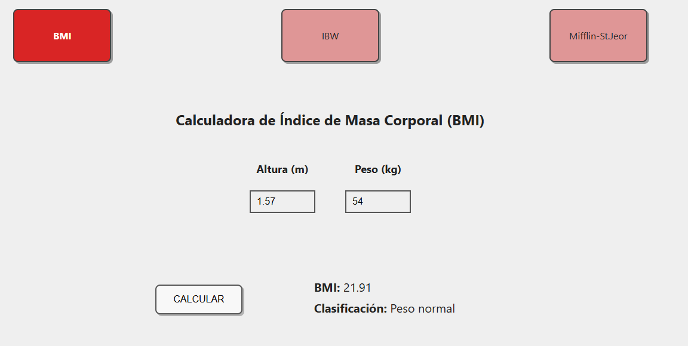
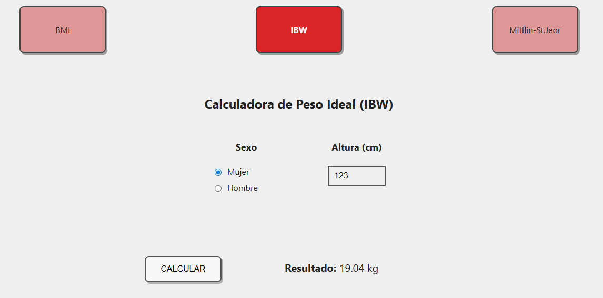
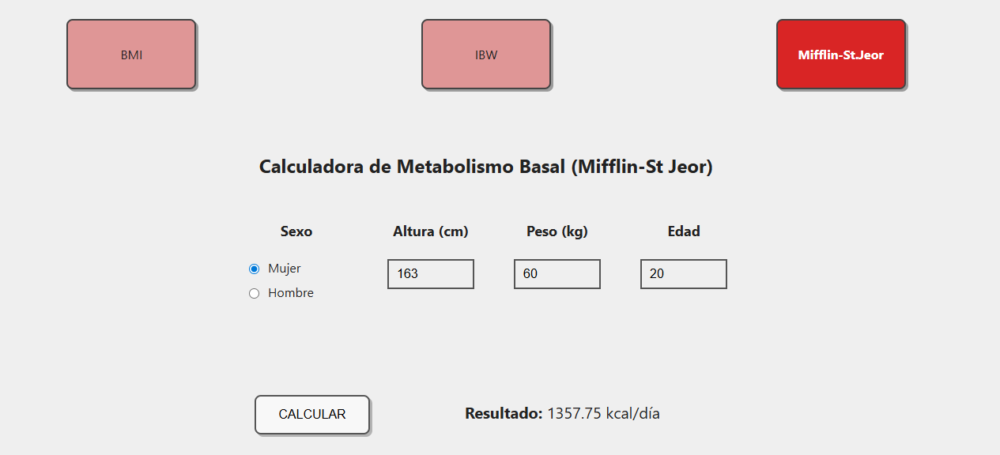

# HealthCalc
Bienvenido al proyecto de la asignatura de **Ingeniería del Software Avanzada**.

El [Hospital Universitario Virgen de la Victoria (El Clínico)](https://www.sspa.juntadeandalucia.es/servicioandaluzdesalud/hospital/virgen-victoria/) de Málaga nos ha encargado el desarrollo de una **Calculadora de Salud** (**_HealthCalc_**) que permita calcular diferentes métricas de los pacientes.

## Requisitos  

<b>Requisitos Funcionales</b>

- La calculadora debe dar soporte a al menos tres métricas.

<b>Requisitos No Funcionales</b>

Para que el proyecto cumpla con estándares de software médico, se deben incluir:
- **Gestión de Errores:** Manejo de excepciones en divisiones por cero (ej. altura 0 en IMC).
  1.  **Validación de Rangos (_Data Scrubbing_):**
      * *Hard Limits:* Bloquear entradas imposibles (ej. altura de 4 metros).
      * *Soft Limits:* Avisos ante valores inusuales pero posibles.
    
        > **Límites Biológicos Reales**:
            * **Altura:** El ser humano más alto registrado midió aproximadamente 272 cm. Un límite de 300 cm es un "Hard Limit" sensato.
            Un recién nacido puede medir 40cm. Un límite inferior sensato es de 30cm.
            * **Peso:** El peso máximo registrado ronda los 635 kg. Un límite de 700 kg sería el tope lógico.
            Un recién nacido puede pesar 2kg. Un límite inferior sensato es de 1kg.
  2.  **Soporte Multi-unidad:** Conversión automática entre sistema métrico (kg, cm) e imperial (lb, ft/in).
  3.  **Gestión de Errores:** Manejo de excepciones en divisiones por cero (ej. altura 0 en IMC).
- Todo el código de la aplicación (incluido los comentarios) deben estar en inglés.
- **Privacidad (_Compliance_):** Si el software almacena datos, debe considerar la anonimización de la Información Personal Identificable (PII) bajo normativas como GDPR o HIPAA.

## Métricas de HealthCalc

<b>Métricas Antropométricas</b>

* **M1: Índice de Masa Corporal (IMC) o _Body Mass Index (BMI)_:** El IMC es es un indicador estándar, adoptado por la [Organización Mundial de la Salud (OMS)](https://www.who.int/es), que evalúa la adecuación del peso de una persona en relación con su altura para estimar la grasa corporal.

    * **Fórmula:** $IMC = \frac{\text{peso (kg)}}{\text{altura (m)}^2}$

    El IMC nos permite clasificar el estado nutricional de una persona en categorías. La OMS ha definido la siguiente clasificación estándar del estado nutricional en adultos:

      - Bajo peso ($<18.5$)
      - Normal ($18.5-24.9$)
      - Sobrepeso ($25-29.9$)
      - Obesidad ($\ge 30$)

---

* **M2: Peso Corporal Ideal (PCI) o _Ideal Body Weight (IBW)_:** El PCI estima el peso teórico que se asocia con el menor riesgo de mortalidad y una mejor salud para un persona.

    Existen diferentes fórmulas para calcular el PCI:

    1. **Fórmula de Devine (1974)**
    Es la más extendida en entornos clínicos para ajustar dosis de medicamentos.

        - **Hombres:** 50 kg + [2.3 × (estatura en pulgadas - 60)]
        - **Mujeres:** 45.5 kg + [2.3 × (estatura en pulgadas - 60)]

    2. **Fórmula de Robinson (1983)**
    Es una variante de Devine más precisa, dando valores más bajos en mujeres y más altos en hombres. 

        - **Hombres:** 52 kg + [1.9 × (estatura en pulgadas - 60)]
        - **Mujeres:** 49 kg + [1.7 × (estatura en pulgadas - 60)]

    3. **Fórmula de Hamwi (1964)**
    Fórmula clásica utilizada por dietistas y nutricionistas debido a su sencillez.

        - **Hombres:** 48.1 kg + [2.7 × (estatura en pulgadas - 60)]
        - **Mujeres:** 45.4 kg + [2.2 × (estatura en pulgadas - 60)]

    4. **Fórmula de Lorentz (1929)**
    Es la fórmula más sencilla de aplicar manualmente ya que utiliza directamente la estatura en centímetros y no requiere conversiones a pulgadas.

        - **Hombres:** $PCI = (Estatura en cm - 100) - \frac{Estatura - 150}{4}$
        - **Mujeres:** $PCI = (Estatura en cm - 100) - \frac{Estatura - 150}{2}$

    **Nota:** Para convertir la estatura de **cm a pulgadas**, hay que dividir los centímetros entre **2.54**.

---

* **M3: Área de Superficie Corporal (ASC) o _Body Surface Area (BSA)_:** El ASC es una medida clínica utilizada para calcular dosis precisas de medicamentos, especialmente en quimioterapia y fluidos intravenosos, y para evaluar la severidad de quemaduras.

    La fórmula más común es la de **Mosteller**:

    * **Fórmula (Mosteller):** $BSA = \sqrt{\frac{\text{altura (cm)} \times \text{peso (kg)}}{3600}}$    

---

* **M4: Perímetro Abdominal (PA) o _Waist Circumference_ (WC):** Es la medición lineal de la circunferencia de la cintura. Se considera el indicador clínico directo de grasa visceral más sencillo y aceptado para predecir obesidad abdominal.
  
    * **Valores de Referencia (Riesgo Elevado):**  
      - **Hombres:** $\ge 94\text{ - }102 \text{ cm}$  
      - **Mujeres:** $\ge 80\text{ - }88 \text{ cm}$

---

* **M5: Índice de Cintura-Cadera (ICC) o _Waist-to-Hip Ratio_ (WHR):** Es ICC la relación entre el perímetro de la cintura y el de la cadera. Se utiliza para identificar la distribución de la grasa (cuerpo tipo "manzana" o "pera") y estimar el riesgo de enfermedades cardiovasculares.
  
    * **Fórmula:** $ICC = \frac{\text{Circunferencia de cintura (cm)}}{\text{Circunferencia de cadera (cm)}}$
    * **Valores de Riesgo (OMS):**  
        - **Hombres:** $> 0.90$  
        - **Mujeres:** $> 0.85$

    Tipos de Morfología:

    1.  **Cuerpo en forma de Manzana (Androide):**
        * **Definición:** La grasa se acumula principalmente en la zona abdominal (tronco).
        * **Implicación Clínica:** Mayor riesgo de hipertensión, diabetes tipo 2 y enfermedades cardíacas debido a la cercanía de la grasa a los órganos vitales (grasa visceral).
        * **Criterio:** Se asigna si el ICC supera los límites de la OMS (>0.90 en hombres, >0.85 en mujeres).

    2.  **Cuerpo en forma de Pera (Ginoide):**
        * **Definición:** La grasa se almacena mayoritariamente en la cadera, glúteos y muslos.
        * **Implicación Clínica:** Generalmente asociada a un menor riesgo metabólico que la forma de manzana, aunque puede relacionarse con problemas articulares o varices.
        * **Criterio:** Se asigna si el ICC está dentro de los rangos normales o bajos.

    | Sexo | Rango ICC | Categoría Morfológica | Riesgo de Salud |
    | :--- | :--- | :--- | :--- |
    | **Hombre** | $\le 0.90$ | Pera (Ginoide) | Bajo / Moderado |
    | **Hombre** | $> 0.90$ | **Manzana (Androide)** | **Alto** |
    | **Mujer** | $\le 0.85$ | Pera (Ginoide) | Bajo / Moderado |
    | **Mujer** | $> 0.85$ | **Manzana (Androide)** | **Alto** |

<b>Métricas Metabólicas y Nutricionales</b>

* **M6: Tasa Metabólica Basal (TMB) o _Basal Metabolic Rate (BMR)_:** El TMB calcula la cantidad mínima de energía (calorías) que el cuerpo necesita en reposo absoluto. 

    Existen diferentes fórmulas para calcular el PCI:

    1. **Ecuación de Mifflin-St Jeor**
    Es actualmente la más precisa para la población general y la que utilizan la mayoría de calculadoras modernas. 

        - **Hombres:**  `TMB = (10 × peso en kg) + (6.25 × altura en cm) - (5 × edad en años) + 5`
        - **Mujeres:**  `TMB = (10 × peso en kg) + (6.25 × altura en cm) - (5 × edad en años) - 161`

    2. **Ecuación de Harris-Benedict (revisada)**
    Es el método clásico. La versión original de 1919 fue revisada en 1984 por Roza y Shizgal para mejorar su exactitud.

        - **Hombres:**  `TMB = 88.362 + (13.397 × peso en kg) + (4.799 × altura en cm) - (5.677 × edad en años)`
        - **Mujeres:**  `TMB = 447.593 + (9.247 × peso en kg) + (3.098 × altura en cm) - (4.330 × edad en años)`

    3. **Ecuación de Katch-McArdle**
    A diferencia de las anteriores, esta fórmula no distingue entre sexos, sino que utiliza la Masa Corporal Magra (peso sin grasa). Es ideal si conoces tu porcentaje de grasa corporal.
        - `TMB = 370 + (21.6 × Masa Corporal Magra en kg)`
            > **Nota:** Masa Magra = Peso total × (1 - % de grasa decimal)

    4. **Ecuación de la OMS (FAO/WHO/UNU)**
    Utilizada a menudo en estudios de salud pública, divide el cálculo por rangos de edad específicos: 

        | Edad (Años) | Hombres | Mujeres |
        | :--- | :--- | :--- |
        | **18 – 30** | `(15.057 × peso) + 692.2` | `(14.818 × peso) + 486.6` |
        | **30 – 60** | `(11.472 × peso) + 873.1` | `(8.126 × peso) + 845.6` |
        | **> 60** | `(11.711 × peso) + 587.7` | `(9.082 × peso) + 658.5` |

---

* **M7: Gasto Energético Diario Total (GEDT) o _Total Daily Energy Expenditure (TDEE)_:** El TDEE es la cantidad total de calorías que el cuerpo quema en 24 horas. Suma el metabolismo basal (funciones vitales en reposo), la actividad física, la digestión y el movimiento cotidiano. Es esencial para ajustar la nutrición (perder, ganar o mantener peso).

    Para obtener las calorías totales que quemas al día, multiplica tu **TMB** por tu nivel de actividad:

    - **Sedentario** (poco/nada de ejercicio): `TMB × 1.2`
    - **Ligero** (ejercicio 1-3 días/semanas): `TMB × 1.375`
    - **Moderado** (ejercicio 3-5 días/semana): `TMB × 1.55`
    - **Fuerte** (ejercicio 6-7 días/semana): `TMB × 1.725`
    - **Muy fuerte** (atleta o trabajo físico pesado): `TMB × 1.9`

<b>Métricas Clínicas, Cardiovasculares, y de Función Orgánica</b>

Estas métricas requieren datos de signos vitales o resultados de laboratorio.

* **M8: Presión Arterial Media (PAM) o _Mean Arterial Pressure_ (MAP):** Representa la presión promedio en las arterias de un paciente durante un ciclo cardíaco completo. Se considera un mejor indicador de la perfusión (entrega de sangre) a los órganos vitales que la presión sistólica por sí sola. Un valor mínimo de 60-65 mmHg es necesario para mantener los órganos sanos.
  
    **Fórmula:** $PAM = \frac{PAS + 2(PAD)}{3}$  
    *(Donde PAS = Presión Arterial Sistólica y PAD = Presión Arterial Diastólica)*.

--- 

* **M9: Índice de Adiposidad Visceral (VAI) o _Visceral Adiposity Index_ (VAI):** Es un indicador empírico que estima la función del tejido adiposo visceral y el riesgo cardiometabólico. Combina medidas físicas (IMC y CC) con parámetros lipídicos (Triglicéridos y HDL).
  
    **Fórmulas:**  
        - **Hombres:** $VAI = \left( \frac{CC}{39.68 + (1.88 \times IMC)} \right) \times \left( \frac{TG}{1.03} \right) \times \left( \frac{1.31}{HDL} \right)$  
        - **Mujeres:** $VAI = \left( \frac{CC}{36.58 + (1.89 \times IMC)} \right) \times \left( \frac{TG}{0.81} \right) \times \left( \frac{1.52}{HDL} \right)$  
    *(Donde CC = Circunferencia de Cintura en cm, TG = Triglicéridos y HDL en mmol/L)*.

--- 

* **M10: Tasa de Filtración Glomerular Estimada (eGFR) o _Estimated Glomerular Filtration Rate_ (eGFR):** Es el "estándar de oro" para evaluar qué tan bien están filtrando la sangre los riñones. Es vital para la detección de la Enfermedad Renal Crónica (ERC) y para ajustar dosis de fármacos.
  
    **Fórmulas Comunes:**  
      * **Cockcroft-Gault (Clásica):** $\frac{(140 - \text{edad}) \times \text{peso}}{72 \times \text{creatinina}} \times (0.85 \text{ si es mujer})$.  
      * **CKD-EPI (Moderna):** Utiliza logaritmos y variables de raza/sexo para mayor precisión (es la recomendada actualmente en software clínico).  
    * **Entradas necesarias:** Creatinina sérica (mg/dL), edad, sexo y etnia.  

--- 

* **M11: Escala NEWS2 o _National Early Warning Score 2_:** Es un sistema de puntuación estandarizado para detectar el deterioro clínico agudo en pacientes adultos. En lugar de una fórmula aritmética simple, es un **sistema de puntos acumulativo** basado en rangos fisiológicos.
  
    **Parámetros Evaluados (7):**
      1. Frecuencia respiratoria.
      2. Saturación de oxígeno.
      3. Uso de oxígeno suplementario (Sí/No).
      4. Presión arterial sistólica.
      5. Frecuencia cardíaca (Pulso).
      6. Nivel de conciencia (Escala ACVPU).
      7. Temperatura.
    * **Lógica de Software:** El sistema suma puntos (0 a 3) por cada parámetro que se desvíe de lo normal. Un puntaje de 5 o más es una "Alerta Roja" que requiere respuesta urgente.

<b>Pruebas de Clasificación Completa (FULL) del IMC/BMI</b>

La clasificación completa (FULL) del IMC divide el estado nutricional en más categorías que la versión básica.  
Se prueban especialmente los valores situados en los límites de cada rango para garantizar que el cambio de categoría se realiza correctamente.

### Categorías FULL

- Delgadez severa: IMC < 16.0  
- Delgadez moderada: 16.0 ≤ IMC < 17.0  
- Delgadez leve: 17.0 ≤ IMC < 18.5  
- Normopeso: 18.5 ≤ IMC < 25.0  
- Sobrepeso: 25.0 ≤ IMC < 30.0  
- Obesidad clase I: 30.0 ≤ IMC < 35.0  
- Obesidad clase II: 35.0 ≤ IMC < 40.0  
- Obesidad clase III: IMC ≥ 40.0  

### Casos de prueba

Se prueban valores representativos y valores situados en los límites de cada rango para comprobar que la clasificación es correcta.

- Si el IMC es 15.9, el sistema debe clasificarlo como Delgadez severa.  
- Si el IMC es 16.0, el sistema debe clasificarlo como Delgadez moderada.  
- Si el IMC es 17.0, el sistema debe clasificarlo como Delgadez leve.  
- Si el IMC es 18.5, el sistema debe clasificarlo como Normopeso.  
- Si el IMC es 25.0, el sistema debe clasificarlo como Sobrepeso.  
- Si el IMC es 30.0, el sistema debe clasificarlo como Obesidad clase I.  
- Si el IMC es 35.0, el sistema debe clasificarlo como Obesidad clase II.  
- Si el IMC es 40.0, el sistema debe clasificarlo como Obesidad clase III.  
- Si el IMC es menor o igual que 0, el sistema debe lanzar una excepción.  
- Si el IMC es mayor que 150, el sistema debe lanzar una excepción.  
- Si el IMC no es un número real finito, el sistema debe lanzar una excepción.  

<b>Pruebas de Clasificación del Estado de Salud basado en el IMC/BMI</b>

Para cada categoría, probamos valores que están justo en el límite para asegurar que el cambio de etiqueta es exacto:  

* **Peso bajo (Underweight):** Se comprueba con valores por debajo de 18.5.
* **Peso normal (Normal weight):** Se comprueba con valores desde 18.5 hasta justo antes de 25.
* **Sobrepeso (Overweight):** Se comprueba con valores desde 25 hasta justo antes de 30.
* **Obesidad (Obesity):** Se comprueba con valores desde 30 en adelante.
* **Seguridad:** Se rechazan clasificaciones para resultados de IMC negativos o absurdamente altos (más de 150).

<b>Pruebas de Cálculo del Peso Corporal Ideal (PCI o IBW)</b>

Las pruebas del cálculo de **Ideal Body Weight (IBW)** verifican tanto la exactitud matemática de la fórmula implementada como la correcta validación de datos de entrada, siguiendo los requisitos de software médico definidos en el proyecto.

### Pruebas de Cálculo Correcto

Validamos que el sistema aplique correctamente la fórmula basada en la estatura en centímetros:

* **Cálculo válido para hombres:**  
  Se comprueba que, al introducir una altura válida (ej. 175 cm) y sexo masculino, el resultado concuerde con la fórmula:  
  50 + 0.9 × (altura − 152.4)

* **Cálculo válido para mujeres:**  
  Se comprueba que, al introducir una altura válida (ej. 160 cm) y sexo femenino, el resultado concuerde con la fórmula:  
  45.5 + 0.9 × (altura − 152.4)

Estas pruebas garantizan que el cálculo matemático es correcto y consistente con la especificación clínica adoptada.

---

###  Pruebas de Validación y Gestión de Errores

De acuerdo con los requisitos no funcionales de **Gestión de Errores** y **Validación de Rangos (Data Scrubbing)**, el sistema debe rechazar entradas inválidas mediante la excepción `InvalidHealthDataException`.

Se verifican los siguientes casos:

* **Altura negativa:**  
  El sistema debe rechazar valores menores que 0 cm.

* **Altura igual a cero:**  
  Se debe lanzar excepción, ya que naturalmente es un valor imposible.

* **Sexo inválido:**  
  El sistema debe rechazar cualquier valor distinto de `"male"` o `"female"`.

---

###  Objetivo de Cobertura

Con estas pruebas se valida:

- Exactitud matemática del cálculo.
- Control de errores ante datos inválidos.
- Comportamiento adecuado ante entradas incorrectas.

<b>Pruebas de Tasa Metabólica Basal (Mifflin-St.Jeor / BMR)</b>

### Objetivo
Validar el cálculo correcto de la **Tasa Metabólica Basal (BMR)** mediante la ecuación de **Mifflin-St Jeor**, así como la gestión de errores ante datos inválidos.

### Fórmulas utilizadas

- **Hombres:**  
  BMR = (10 × peso) + (6.25 × altura) − (5 × edad) + 5

- **Mujeres:**  
  BMR = (10 × peso) + (6.25 × altura) − (5 × edad) − 161

---

### Casos de prueba

 **Cálculo válido (hombre)**  
Se verifica el cálculo correcto con valores normales y tolerancia ±0.01.

 **Cálculo válido (mujer)**  
Se comprueba la correcta aplicación de la constante específica por sexo.

 **Valor de diferencia entre sexos**  
Con los mismos datos, la diferencia entre hombre y mujer debe ser **166 kcal/día**.

 **Validación de datos inválidos**
- Peso negativo → `InvalidHealthDataException`
- Peso igual a cero → excepción
- Altura negativa → excepción
- Altura igual a cero → excepción

---

### Cobertura
Estas pruebas garantizan:
- Correcta implementación de Mifflin-St Jeor  
- Diferenciación entre sexo  
- Precisión decimal en cálculos  

## Instalación y ejecución

<b>Python</b>

### Dependencias
- Python 3.13+
- pytest
- coverage
- pytest-cov

### Preparación del entorno
1. Clonar este repositorio: `git clone https://github.com/IngSoftAvanz/healthcalc.git`
2. Desplazarse a la carpeta del proyecto:  
   `cd healthcalc/python-project-healthcalc`
3. Crear entorno virtual: `python -m venv env`
4. Activar el entorno virtual:
   - En Windows: `.\env\Scripts\Activate`
   - En Linux: `. env/bin/activate`
5. Instalar dependencias: `pip install -r requirements.txt`

### Ejecución

Una vez instalado el entorno y las dependencias, se puede ejecutar la aplicación web con el siguiente comando:

python main_web.py

-Una vez ejecutado el comando, podemos acceder a la aplicación pulsando el enlace resultante en la terminal: http://127.0.0.1:5000/

-Para la ejecución de los tests usamos el comando: pytest -v

-Conviene tener instalada la librería "flask" para la ejecución de la app, si no la tiene instalada, la puede instalar con el comando correspondiente en la terminal: pip install flask

<b>Java</b>

### Dependencias
- Java JDK 18+
- Maven
- JUnit
- Jacoco
  
### Preparación del entorno
1. Clonar este repositorio: `git clone https://github.com/IngSoftAvanz/healthcalc.git`
2. Desplazarse a la carpeta del proyecto:
   `cd healthcalc/java-project-healthcalc`
3. Compilar con Maven: `mvn clean compile`

### Ejecución
- Ejecutar la aplicación: Clic en Run usando el IDE.
- Ejecutar los tests: Clic en Run Tests usando el IDE o con Maven: `mvn test`
- Ejecutar los tests con informe de cobertura (previamente configurado en pom.xml): `mvn test`

## Behaviour Driven Development

<b>IBW - Ideal Body Weight (Peso Corporal Ideal)</b>

### Historia de usuario
Como usuario de la calculadora de salud,  
quiero calcular mi peso corporal ideal,  
para conocer un peso recomendado según mi altura y sexo.

### Escenarios

- Cálculo válido para hombre  
- Cálculo válido para mujer  
- Altura negativa  
- Altura igual a cero  
- Sexo inválido  

### Fichero feature  
[ibw.feature](python-project-healthcalc/features/ibw.feature)

<b>BMI - Body Mass Index (Índice de Masa Corporal)</b>

### Historia de usuario
Como usuario de la calculadora de salud,
quiero calcular mi índice de masa corporal,
para conocer si mi peso está en un rango adecuado según mi altura.

### Escenarios

- Cálculo válido del BMI
- Cálculo válido del BMI con otro valor
- Peso negativo
- Peso igual a cero
- Altura negativa
- Altura igual a cero 

### Fichero feature  
[bmi.feature](python-project-healthcalc/features/bmi.feature)

<b>BMI Full - Clasificación completa del Índice de Masa Corporal</b>

### Historia de usuario
Como usuario de la calculadora de salud,  
quiero conocer la clasificación completa de mi índice de masa corporal,  
para entender mejor mi estado nutricional.

### Escenarios

- Clasificación correcta del BMI Full
- BMI inválido por valor no permitido
- BMI no es un número real finito

### Fichero feature  
[bmi_full.feature](python-project-healthcalc/features/bmi_full.feature)

<b>BMR - Basal Metabolic Rate (Mifflin-St Jeor)</b>

### Historia de usuario
Como usuario de la calculadora de salud,  
quiero calcular mi tasa metabólica basal usando la fórmula de Mifflin-St Jeor,  
para estimar las calorías mínimas que necesito en estado de reposo.

### Escenarios

- Cálculo válido para hombre  
- Cálculo válido para mujer  
- Peso negativo  
- Peso igual a cero  
- Altura negativa  
- Altura igual a cero  

### Fichero feature  
[bmr.feature](python-project-healthcalc/features/bmr.feature)

## Interfaz Gráfica de Usuario

A continuación se muestra una captura de la aplicación web en ejecución.

### Ejemplo de uso

